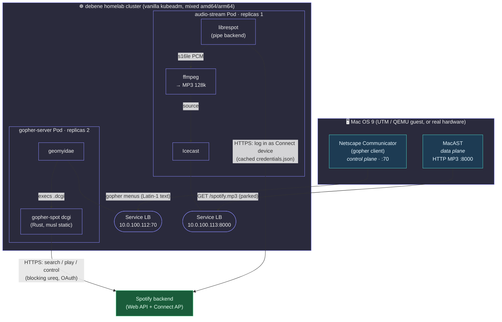
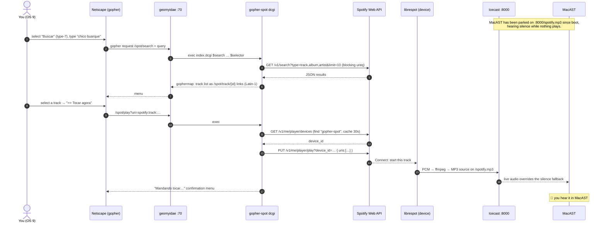
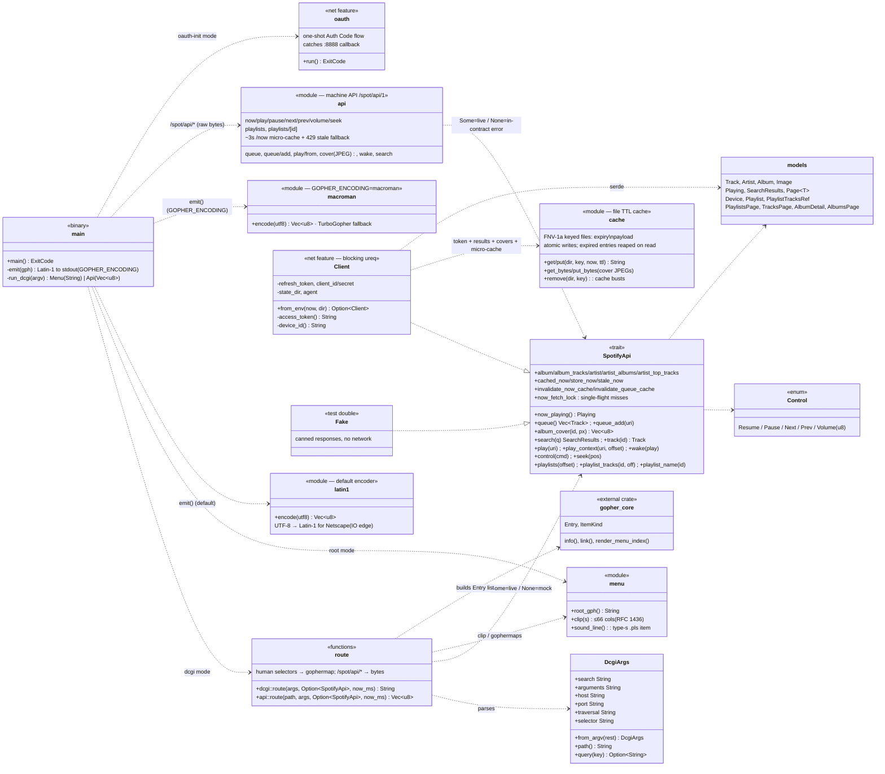
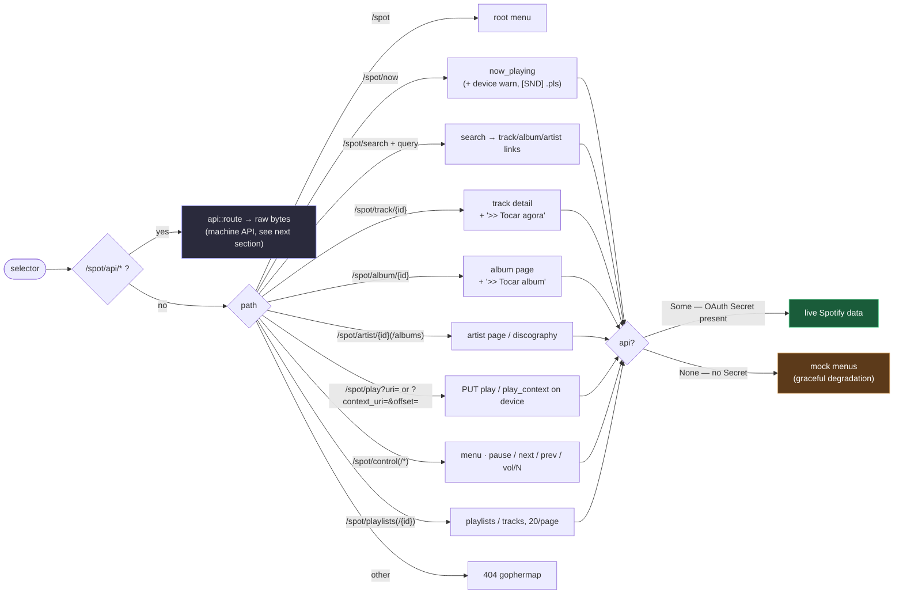
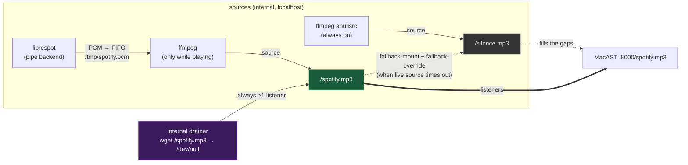
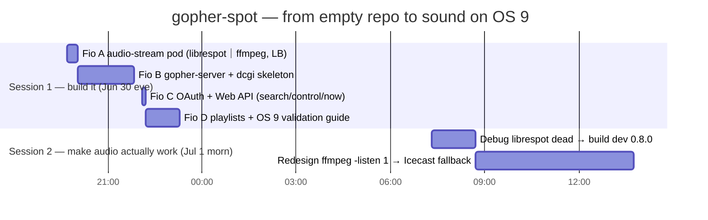

# gopher-spot

**Spotify Connect, controlled from Mac OS 9 over the Gopher protocol (RFC 1436,
1991). Runs 100% on a homelab Kubernetes cluster. LAN-only.**

You search, browse playlists, and drive playback from **Netscape Communicator's
built-in Gopher browser** (TurboGopher works too) on a 1999 Mac — inside a
UTM/QEMU VM, or on real hardware — and the music comes out of **MacAST**, a
classic MP3 player parked on the stream. No Spotify app, no modern web, no
JavaScript, no TLS: a 1997 browser speaks a 1991 protocol to reach a 2020s
streaming service, on an OS that shipped on beige plastic.

It works. That is the whole point. See [PROMPT.md](PROMPT.md) for the original
design brief and [the build story](#build-story) for what it cost.

---

## Contents

- [The idea in one diagram](#the-idea-in-one-diagram)
- [How a "play this track" request flows](#how-a-play-this-track-request-flows)
- [Code map (UML)](#code-map-uml)
- [dcgi routing](#dcgi-routing)
- [The machine API (for the native clients)](#the-machine-api-for-the-native-clients)
- [Upstream protection (Spotify rate limits)](#upstream-protection-spotify-rate-limits)
- [Audio delivery: the Icecast fallback](#audio-delivery-the-icecast-fallback)
- [Design decisions](#design-decisions)
- [Hard-won gotchas](#hard-won-gotchas)
- [Build & deploy](#build--deploy)
- [Build story](#build-story)
- [Repo layout](#repo-layout)

---

## The idea in one diagram

The trick is a **split between the control plane and the data plane**. Gopher was
never going to carry a 128 kbps MP3 to a G3 — so it doesn't. The Gopher client only
ever sends and receives tiny text menus; the audio travels on a completely separate
HTTP stream that a dedicated MP3 player (MacAST) holds open. Two MetalLB
LoadBalancer IPs, two jobs.



Key consequences of the split:

- **OS 9 never touches the MP3 through Gopher.** Netscape issues a `PUT play`
  via the dcgi; the audio is already flowing to MacAST on the other socket.
- **The dcgi has no idea what audio sounds like.** It's a stateless text
  transformer: selector in, gophermap out.
- **librespot never opens a port for OS 9.** It's an *outbound* Spotify Connect
  device; the phone/desktop "transfers playback" to it through Spotify's cloud,
  and it pipes raw PCM into ffmpeg locally.

---

## How a "play this track" request flows

The moment that makes the whole thing feel like magic: you pick a track in a
gopher menu on a 25-year-old Mac and, a beat later, it's playing.



The dcgi is exec'd **fresh for every one of those arrows** — geomyidae spawns a
new process per request. That single fact drives half the architecture (see the
[disk cache](#code-map-uml) and [the caching decision](#design-decisions)).

---

## Code map (UML)

One Rust binary, `gopher-spot`, wears three hats depending on argv (`root`,
`dcgi`, `oauth-init`). The library is deliberately split so **everything except
the HTTP client compiles and tests without a network** — the `net` Cargo feature
gates only `ureq`. Rendering is tested against a fake `SpotifyApi`.



| Module          | Responsibility                                                                   |
|-----------------|----------------------------------------------------------------------------------|
| `main.rs`       | argv dispatch (`root`/`dcgi`/`oauth-init`); wire-encode at the stdout edge; split `/spot/api/*` bytes from human gophermaps. |
| `dcgi.rs`       | Parse geomyidae's 6 args; route a **human** selector to a gophermap. Pure, fake-testable. |
| `api.rs`        | The **machine API** (`/spot/api/1/*`): tab-delimited UTF-8 (or raw cover JPEG) served verbatim by a `.cgi`. Frozen v1 contract — see [`API.md`](API.md). |
| `spotify.rs`    | `SpotifyApi` trait + response models + the real blocking `ureq` `Client`.        |
| `cache.rs`      | File-backed TTL cache (token; search 5 min; devices 30 s; playlists 60 s; queue 10 s; albums/artists/covers 24 h; `/now` micro-cache ~3 s + 30 s stale copy; 429 cooldown = `Retry-After`; catalog 404s negative-cached 5 min). Atomic temp+rename writes; expired entries reaped on read. |
| `latin1.rs`     | **UTF-8 → Latin-1** transcode (the default) so Netscape Communicator renders accents right. |
| `macroman.rs`   | UTF-8 → Mac OS Roman transcode — the `GOPHER_ENCODING=macroman` fallback (TurboGopher). |
| `menu.rs`       | The static root menu, the RFC-1436 66-column clip, the type-`s` `.pls` line.     |

**97 unit tests**, all offline (`cargo test --no-default-features` builds the pure
core — 88 tests; `cargo test` adds the URL-encoding, device-pick, circuit-breaker,
and cache-bust tests, still without a network). Rendering (human menus and the
machine API) is tested against a fake `SpotifyApi`.

---

## dcgi routing

geomyidae runs `/srv/spot/index.dcgi` (a one-line wrapper → `gopher-spot dcgi`)
for *any* non-existent `/spot/*` selector, handing it
`$search $arguments $host $port $traversal $selector` and reading stdout as a
gophermap. `route()` dispatches purely on the normalized selector path:



`main` splits on the path first: `/spot/api/*` goes to `api::route` (raw bytes —
the [machine API](#the-machine-api-for-the-native-clients)), everything else to the
human `dcgi::route`. Both take `Option<&dyn SpotifyApi>`: `Some` on the live path,
`None` when the OAuth Secret is absent — the human router then serves mock menus
and the machine API an in-contract `upstream` error, instead of crashing.
`/spot/stream.pls` is *not* routed here — it's a **real static file** (type-`s`,
served verbatim) generated at startup from `$AUDIO_STREAM_URL`, because a `.pls`
must be served raw, not interpreted as a menu.

---

## The machine API (for the native clients)

The human Gopher menus are PT-BR gophermaps meant for a person driving Netscape on
Mac OS 9. The native clients — first **[DeToca](https://github.com/felipedbene/detoca)**, a
native **Mac OS X 10.6** client (Snow Leopard, non-ARC Cocoa), then DeGelato and
Casquinha (below) — need a stable,
machine-parseable surface instead of scraping localized menu text. That's the
**machine API** at **`/spot/api/1/*`**: a frozen, versioned contract. Full spec in
[`API.md`](API.md); the shape:

- **Transport.** Each endpoint is a type-0 document of `key<TAB>value` lines,
  **UTF-8**, CRLF. It's served **raw** by a `.cgi` (`/srv/spot/api/index.cgi`) so
  geomyidae pipes stdout to the socket verbatim — tabs and non-Latin-1 bytes
  survive, and there is **no Latin-1 transcode** (that's only for the human
  menus). `main` routes `/spot/api/*` to `api::route` (→ `Vec<u8>`), never through
  the gophermap router.
- **Frozen v1.** Additive changes (new keys) stay in v1; clients MUST ignore
  unknown keys. Breaking changes would go to `/spot/api/2`.

| Endpoint | Purpose |
|----------|---------|
| `now` | playback snapshot: `state`, track/artist/album, `album_id`, `position_ms`/`duration_ms`, `volume`, `queue_len`, **`device active\|idle`**, `ts`. Cached **~3 s** (a poll burst = one upstream fetch; commands bust it); during a Spotify 429 cooldown it serves the last good snapshot (≤30 s, original `ts`) before surfacing `error rate_limited`. |
| `play` `pause` `next` `prev` `volume?N` `seek?N` | transport; each replies with a fresh `now` snapshot. |
| `queue` · `queue/add?<uri>` | upcoming tracks; enqueue a track. No `queue/clear` (the Web API has none). |
| `play/from?ids=…&offset=N` | native "play from here onward": start an explicit list (≤24 bare base62 track ids) at `offset`; Spotify owns the continuation (auto-advance, `next`/`prev` in-list). Old servers answer `not_found` — the client's feature-detect. |
| `cover/<album_id>/<size>` | **raw JPEG** (type-`I`), sizes 64/300/640, disk-cached 24 h. The one binary endpoint. |
| `search?q=<urlencoded>` | track search (UTF-8 query); capped at 10 (Spotify 400s `limit>10`). |
| `wake[?play=1]` | transfer playback to the gopher-spot device (recover a `device idle`); `no_device` if librespot is down. |
| `playlists` · `playlists/<id>` | list the user's playlists; open one. **Caveat:** Spotify's Nov-2024 dev-mode block 403s playlist *track* reads for this app — even the user's own — so `playlists/<id>` returns `forbidden` today (names/ids still list, and `/spot/play?context_uri=` still plays a playlist as a context). |

Errors are `key<TAB>value` too: `api` / `error <code>` / `message`. Codes:
`bad_range`, `bad_uri`, `bad_query`, `no_track`, `no_device`, `not_found`,
`forbidden`, `rate_limited` (Spotify is throttling the bridge — keep the last
snapshot, retry shortly), `upstream`.

Writing or auditing a client? **[`CLIENTS.md`](CLIENTS.md)** is the best-practices
guide (poll cadence, `ts` interpolation, `rate_limited` handling, cover caching)
with a spot-check checklist.

The DeToca client now consumes this **whole** surface (its *fio 10*): a
cover-forward player, the "up next" queue with thumbnails, track search, the
playlists list with context play, and `device`/`wake` recovery — see
[DeToca's README](https://github.com/felipedbene/detoca#the-full-radinho-fio-10).

**Three native clients** speak `/spot/api/1`, one per rung of the vintage ladder:
[DeToca](https://github.com/felipedbene/detoca) (Mac OS X 10.6),
[DeGelato](https://github.com/felipedbene/degelato) (Sorbet Leopard 10.5 / PowerPC),
and [Casquinha](https://github.com/felipedbene/casquinha) (Mac OS 9.2 / classic
Toolbox — the oldest machine yet). They all follow one recipe,
[**fhb ▸ CLIENT-PATTERN.md**](https://github.com/felipedbene/fhb/blob/main/CLIENT-PATTERN.md),
against the rules in [`CLIENTS.md`](CLIENTS.md).

> **⚠ handlecgi trap.** geomyidae's `handlecgi` splices the child's **stderr** into
> the client socket, so any `eprintln!`/panic on an API request path prepends bytes
> to the response — invisible on text, but it *corrupts the cover JPEG*. Rule:
> **never write to stderr on the `/spot/api/*` path.**

## Upstream protection (Spotify rate limits)

Spotify's **player** endpoints (`/v1/me/player*`) rate-limit on a rolling window
at surprisingly low volume: a single client polling `/now` every 2 s through two
round-robin replicas was enough to trip sustained 429s (each miss cost two player
calls, the per-replica cache was never warm for one poller, and nothing honored
`Retry-After` — so the window never drained). The bridge now layers defenses
between every client and Spotify:

| Layer | What it does |
|-------|--------------|
| `/now` micro-cache (~3 s) | A poll burst = one upstream fetch; every poll in the window gets the **same document, same `ts`** (clients interpolate). Commands bust it so state changes are never masked. |
| Single-flight | Concurrent cache misses in one replica serialize on a lockfile — for the `/now` fetch *and* the token refresh — so a burst costs one upstream call, not one per dcgi process. |
| Circuit breaker | Any Web-API 429 arms a cooldown from `Retry-After` (default 5 s, capped 60 s). While armed, **no request leaves the bridge**: every call path short-circuits, letting Spotify's window actually drain. |
| Stale-serve | During a cooldown, `/now` returns the last good snapshot (≤30 s old, original `ts`) instead of an error, so a polling client keeps rendering; past that it's `error rate_limited`. |
| Call minimization | The queue is cached 10 s and busted only by queue-changing commands (next/prev/queue-add/play-from); `/now` skips the queue call entirely when stopped; catalog 404s are negative-cached 5 min; the play/pause idempotency probe fires only on a real 403. |
| Session affinity | `sessionAffinity: ClientIP` on the Service pins each client to one replica, so the per-replica caches are actually warm for a steady poller. |

Measured effect when this landed: **~60 player calls/min → ~17** for a 2 s
poller, zero 429s over 150 polls. What the *clients* must do to keep it that way
is in [`CLIENTS.md`](CLIENTS.md).

---

## Audio delivery: the Icecast fallback

The audio-stream container runs **Icecast**, a persistent streaming server, fed by
`librespot | ffmpeg`. An earlier `ffmpeg -listen 1` design served exactly one
client, only while a track was actively producing PCM, and dropped on every
pause/track-gap — so MacAST got "connection refused" most of the time. Icecast
fixes all three failure modes with a **silence fallback mount**:



- **Never refused:** idle → listeners hear `/silence.mp3`; a track → `/spotify.mp3`
  overrides and snaps them to live audio.
- **Multi-client:** many listeners off one source.
- **Zero listeners never stops playback** (fio S3/1): an **internal drainer**
  permanently reads `/spotify.mp3` → `/dev/null`, so Icecast always drains the
  source. Without it, a playing track with no external listener let the source
  back up, `ffmpeg` block, and librespot idle (its Connect device dropping).
- **Self-healing:** PCM flows through a **FIFO** so the entrypoint holds
  librespot's PID; if `ffmpeg` dies (stale Icecast socket), the loop kills
  librespot and respawns the whole chain in ~2 s with a fresh source. Total
  Icecast death is caught k8s-natively by the `livenessProbe` (TCP :8000).

Clients still only ever dial `:8000/spotify.mp3`, so nothing changed for the dcgi,
the `.pls`, or the Service. Image is **~60 MB** compressed (alpine's `ffmpeg` apk
alone is ~30–40 MB of libav*/lame; the `<40 MB` PROMPT target was not chased — LAN
pulls once). The gopher-server image is ~5 MB (musl-static Rust + geomyidae).

---

## Design decisions

Answers to the three open questions in [PROMPT.md](PROMPT.md):

1. **librespot: build from source, from the `dev` branch (0.8.0).** No official
   static multi-arch binaries exist, and building lets us `--no-default-features`
   to drop every system audio backend (alsa/pulse/rodio/portaudio/jack) *and*
   libmdns — the always-compiled pipe backend is all we need. We build **dev, not
   the 0.6.0 crates.io release**: after a Spotify server-side change (~Nov 2025,
   [librespot #1623](https://github.com/librespot-org/librespot/issues/1623)) 0.6.0
   can't load any track ("not available in any supported format") — auth works,
   playback is dead. Pinned to `LIBRESPOT_REV`; TLS is rustls-webpki (dev requires
   an explicit TLS backend). Bump when a fixed release lands.

2. **gopher-server: one image.** geomyidae + the dcgi binary in a single image;
   geomyidae execs the dcgi by `.dcgi` extension + exec bit. A split Deployment
   would need a shared filesystem or a network-exec shim for zero real benefit.

3. **librespot cache: `emptyDir`.** A PVC would be RWO and pin the pod to one node
   — directly fighting the "scheduler decides, nothing pinned" constraint. In
   credentials mode there's nothing worth persisting: on restart the entrypoint
   re-seeds `credentials.json` from the Secret into the fresh emptyDir, no
   re-login.

### Discovery — credentials mode (not zeroconf)

The PROMPT assumed the pod shows up in the phone's Spotify Connect list via
**zeroconf** (mDNS). **That can't work from an overlay pod without `hostNetwork`**
(forbidden): mDNS is link-local multicast (`224.0.0.251:5353`); it originates in
the pod's netns and never crosses the CNI boundary onto the LAN, and MetalLB only
forwards the one TCP port. So the deployment runs in **`credentials` mode**:
librespot logs into Spotify's access point with a cached `credentials.json` and
appears as a Connect device *through Spotify's backend*, needing only outbound
HTTPS. `LIBRESPOT_MODE` selects `credentials` (in-cluster default) vs `zeroconf`
(local `--network host` testing only).

---

## Hard-won gotchas

The things that cost real debugging time — most now live in code comments, all of
them earned:

| # | Gotcha | Fix |
|---|--------|-----|
| 1 | librespot **0.6.0 can't play any track** after a Nov-2025 Spotify change (auth + device OK, zero PCM). | Build the **dev branch (0.8.0)**, pinned rev, `--features rustls-tls-webpki-roots`. |
| 2 | Spotify `/v1/search` **400s "Invalid limit" for any `limit>10`** (verified: 20 *and* 50 both fail, even single-type) despite docs saying 0–50. | Hard-cap `SEARCH_LIMIT=10`. |
| 3 | Spotify **deprecated `localhost`** in OAuth redirect URIs. | Explicit loopback `http://127.0.0.1:8888/callback`, registered + used identically. |
| 4 | librespot **zeroconf (mDNS) can't reach the LAN from an overlay pod**. | Credentials mode (see Discovery). |
| 5 | `ffmpeg -listen 1` gave **"connection refused" on idle**, one client only, dropped on gaps. | Icecast + silence fallback + FIFO respawn + internal drainer. |
| 6 | Binding **:70 as non-root** in the pod. | File cap `cap_net_bind_service=+ep` on geomyidae + keep `NET_BIND_SERVICE` in the bounding set + `allowPrivilegeEscalation: true`. |
| 7 | geomyidae stamps `GOPHER_HOST` into every link; wrong value → **links won't follow** from the Mac. | Set it to the gopher-server LB IP (chicken-and-egg: apply, read IP, re-apply). |
| 8 | An **in-process cache never survives** — the dcgi is exec'd per request. | File TTL cache in an emptyDir (`cache.rs`). |
| 9 | Accented names (`Construção`) rendered as garbage on OS 9. The actual client is **Netscape**, which reads charset-less Gopher as **Latin-1** — not MacRoman. | `latin1::encode` at the stdout edge (default); `macroman` kept as the `GOPHER_ENCODING` fallback. ASCII (incl. every `[ ] \| \t \n`) is identity. |
| 10 | ghcr packages default **private** → `ImagePullBackOff`. | Make packages public (or use the `ghcr-pull` imagePullSecret). |
| 11 | geomyidae's **`handlecgi` splices the child's stderr** into the client socket → any `eprintln!` on the `/spot/api/*` path corrupts the response (silently for text; a garbled cover JPEG for binary). | **Never write to stderr on the API path.** |
| 12 | Spotify **403s playlist track reads for every playlist — including the user's own** (Nov-2024 dev-mode block, *not* a scope gap: the token has `playlist-read-private`). | Map 403→`forbidden`; list names/ids only; play playlists as a **context** (needs no track-read). |
| 13 | `%XX` query decode as Latin-1 **mangles UTF-8** (`search?q=construção`). | Decode into bytes, then `from_utf8_lossy` (`DcgiArgs::query`). |
| 14 | Spotify **player endpoints 429 at low volume** (one 2 s `/now` poller tripped it) and calling during the window prolongs it. | The layered defense in [Upstream protection](#upstream-protection-spotify-rate-limits): micro-cache + single-flight + `Retry-After` circuit breaker + stale-serve + session affinity. |
| 15 | **External DNS silently dead on some nodes**: kubelet leaks the node's `search debene.dev …` into pods (`ndots:5`), the public `debene.dev` zone answers **NOERROR/empty** (not NXDOMAIN) for bogus subdomains, and musl's `getaddrinfo` treats that as terminal — librespot got "could not initialize spirc: Service unavailable" on any pod scheduled onto such a node, while `nslookup` (direct query) worked fine. | `dnsConfig: {options: [{name: ndots, value: "1"}]}` on both Deployments — FQDNs resolve absolute-first, the search path is never consulted (nothing uses short cluster-internal names). |

---

## Build & deploy

Prereqs: `docker buildx` logged into `ghcr.io`, `kubectl` on the cluster, MetalLB
with a free pool address (pool is `10.0.100.x`).

```sh
# ── audio-stream ───────────────────────────────────────────────
./scripts/buildx.sh audio                       # multi-arch build + push

# seed the player identity once, on a LAN box with the Spotify app:
librespot --name gopher-spot --cache ./c --disable-audio-cache --backend pipe >/dev/null &
#   phone → Spotify → Connect → pick "gopher-spot"; it writes ./c/credentials.json
kill %1
kubectl apply -f deploy/namespace.yaml
kubectl -n gopher-spot create secret generic librespot-credentials \
  --from-file=credentials.json=./c/credentials.json

kubectl apply -f deploy/audio-stream.yaml
kubectl -n gopher-spot get svc audio-stream -o wide   # note the LB IP → :8000

# ── gopher-server ──────────────────────────────────────────────
./scripts/buildx.sh server
# set AUDIO_STREAM_URL + GOPHER_HOST in deploy/gopher-server.yaml to the LB IPs
kubectl apply -f deploy/gopher-server.yaml
kubectl -n gopher-spot get svc gopher-server -o wide  # note the LB IP → :70

# ── Web API OAuth (one-shot, on a box with a browser) ──────────
# Register redirect URI http://127.0.0.1:8888/callback in the Spotify dashboard.
SPOTIFY_CLIENT_ID=… SPOTIFY_CLIENT_SECRET=… ./scripts/spotify-oauth-init.sh
kubectl apply -f deploy/secrets.yaml              # gitignored
kubectl rollout restart deployment/gopher-server -n gopher-spot
```

Without the `spotify-oauth` Secret, the server still starts and serves the mock
menus (`optional: true` on the `secretRef`). Local smoke tests and the manual
OS 9 validation checklist live in
[`scripts/validate-os9.md`](scripts/validate-os9.md) — including a
recipe to run a local server on the QEMU host's vmnet IP so the OS 9 guest reaches
it without cluster routing.

---

## Build story

The **original build** was solo, across **two sittings**, ~10 hours of active
work, **14 commits**, ~1,600 lines of Rust (28 tests) plus Dockerfiles, k8s
manifests, and shell. (It has since grown — see the note after the timeline.)



- **Session 1 (Jun 30, ~3.5 h):** the entire thing — both pods, the dcgi, OAuth,
  the Web API, playlists, MacRoman, 28 tests — went from nothing to committed. The
  four "fios" (A→D) map one-to-one onto commits. Fast because the shape was clear.
- **Session 2 (Jul 1, ~6.5 h):** the *hard* part, and only 2 commits to show for
  it. Audio was "ta quebrado" — control worked, but MacAST got connection-refused.
  Two separate root causes, each a rabbit hole: (1) **librespot 0.6.0 was silently
  dead** post a Spotify server change — hours ruled out plumbing before pinning the
  dev branch; (2) `ffmpeg -listen 1` was **too fragile to keep a stream up**,
  requiring the full **Icecast** redesign. Then it played "Construção" end to end.

The lopsided ratio — features in an evening, one audio bug across a morning — is
the real lesson: gluing modern SaaS to vintage clients, the protocol translation
is easy; the **stateful media plane** is where the time goes.

**Since then** (2026-07-02/06) the project roughly doubled: a navigable music
graph (album/artist/discography pages), the switch to **Latin-1** for Netscape,
inline transport controls, audio robustness (FIFO respawn + internal drainer),
the whole **`/spot/api/1` machine API** for the native clients (`now`/transport,
`queue`, `cover`, `search`, `device`+`wake`, `playlists`, context play,
`play/from` list playback), and the
**rate-limit hardening** ([Upstream protection](#upstream-protection-spotify-rate-limits)).
Current totals: **~44 commits, ~5,000 lines of Rust, 112 tests.**

---

## Repo layout

```
gopher-spot/
├── README.md                         # this file
├── API.md                            # frozen /spot/api/1 machine-API contract
├── CLIENTS.md                        # client best-practices guide + spot-check checklist
├── PROMPT.md                         # original design brief (pt-BR)
├── Cargo.toml                        # net feature gates ureq; serde always on
├── src/
│   ├── main.rs                       # argv dispatch + Latin-1 stdout edge + api/menu split + oauth
│   ├── lib.rs                        # module root
│   ├── dcgi.rs                       # human selector → gophermap routing (fake-testable)
│   ├── api.rs                        # machine API /spot/api/1 → bytes (fake-testable)
│   ├── spotify.rs                    # SpotifyApi trait + models + blocking Client
│   ├── cache.rs                      # file-backed TTL cache (byte-safe; remove)
│   ├── latin1.rs                     # UTF-8 → Latin-1 (default, for Netscape)
│   ├── macroman.rs                   # UTF-8 → Mac OS Roman (GOPHER_ENCODING fallback)
│   └── menu.rs                       # root menu, 66-col clip, type-s .pls line
├── docker/
│   ├── audio-stream.Dockerfile       # librespot(dev) + ffmpeg + icecast, multi-arch
│   ├── audio-stream-entrypoint.sh    # the Icecast + silence-fallback pipeline
│   ├── gopher-server.Dockerfile      # geomyidae(src) + dcgi, musl static, :70 cap
│   └── gopher-server-entrypoint.sh   # renders stream.pls, execs geomyidae
├── deploy/
│   ├── namespace.yaml
│   ├── audio-stream.yaml             # Deployment(1, Recreate) + Service LB
│   ├── gopher-server.yaml            # ConfigMap + Deployment(2) + Service LB
│   ├── secrets.yaml.template         # Web API OAuth (secrets.yaml is gitignored)
│   └── kustomization.yaml
└── scripts/
    ├── buildx.sh                     # multi-arch build + push
    ├── spotify-oauth-init.sh         # one-shot OAuth → deploy/secrets.yaml
    └── validate-os9.md               # manual OS 9 validation checklist
```

### Non-goals

No VPS (`gopher.debene.dev` is untouched), no Spotify reimplementation (librespot
does Connect), no GUI anywhere but Gopher, no Spotify Free (Premium only), no
gapless, no public exposure. LAN-only, by design. (Cover art *is* served — as raw
JPEG on the machine API's `cover` endpoint for the DeToca client — but the human
Gopher menus stay text-only.)
