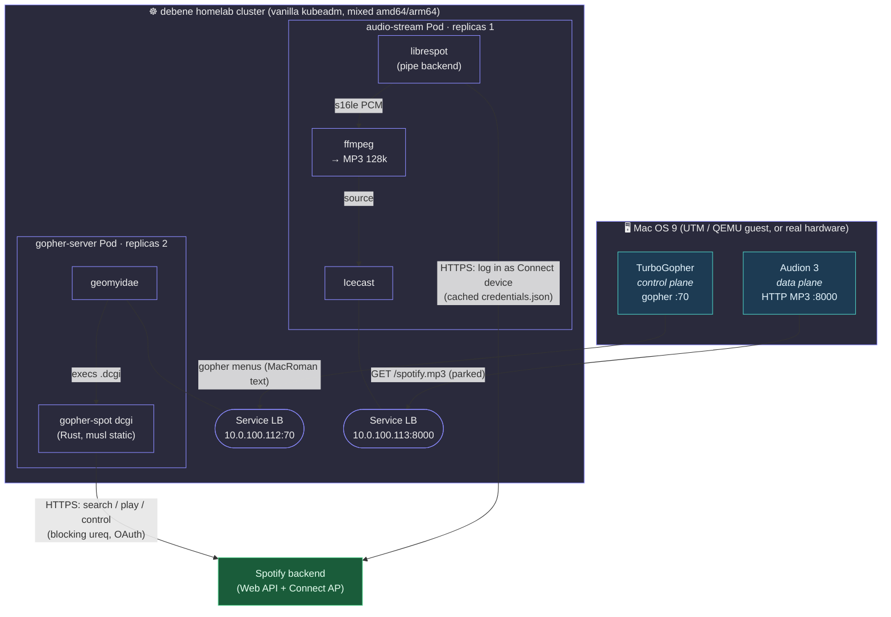
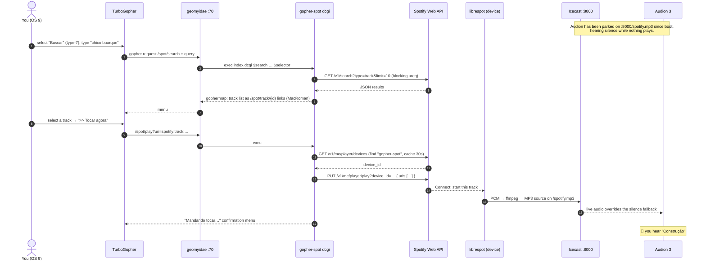
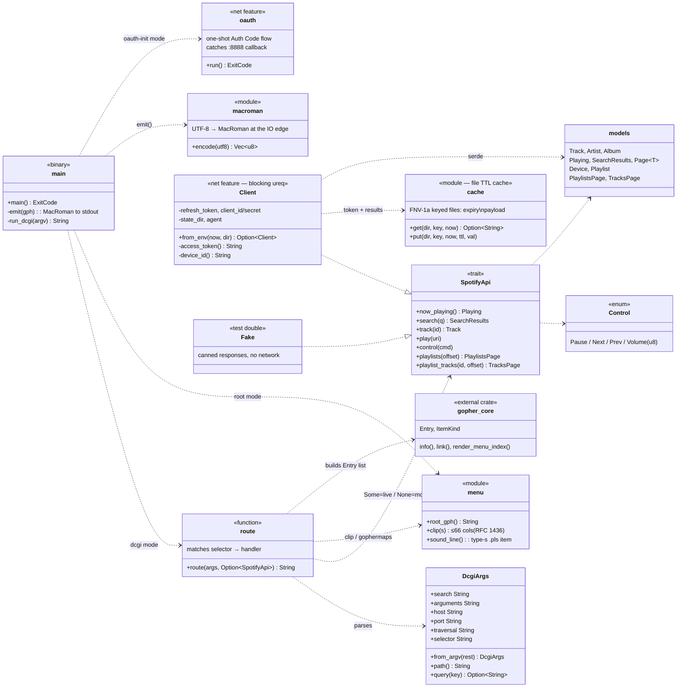
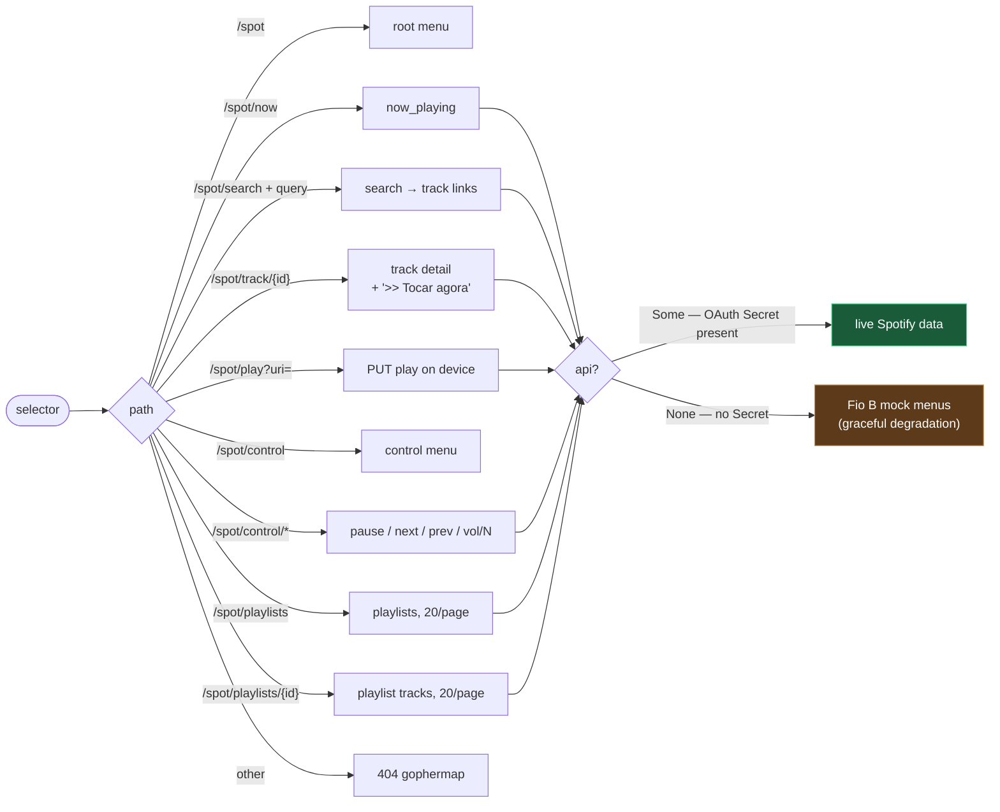
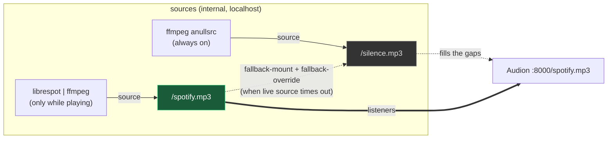
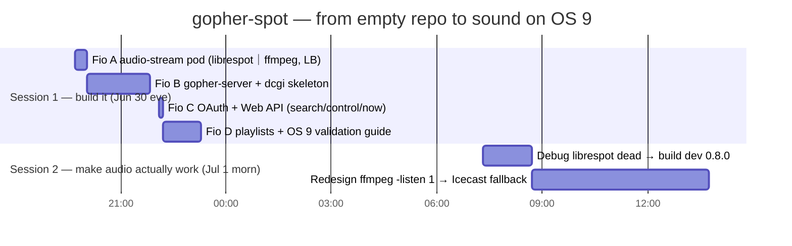

# gopher-spot

**Spotify Connect, controlled from Mac OS 9 over the Gopher protocol (RFC 1436,
1991). Runs 100% on a homelab Kubernetes cluster. LAN-only.**

You search, browse playlists, and drive playback from **TurboGopher** (or
Netscape's gopher client) on a 1999 Mac — inside a UTM/QEMU VM, or on real
hardware — and the music comes out of **Audion 3** parked on an MP3 stream. No
Spotify app, no browser, no JavaScript, no TLS. A protocol older than the Web
carries a 2020s streaming service to an OS that shipped on beige plastic.

It works. That is the whole point. See [PROMPT.md](PROMPT.md) for the original
design brief and [the build story](#build-story) for what it cost.

---

## Contents

- [The idea in one diagram](#the-idea-in-one-diagram)
- [How a "play this track" request flows](#how-a-play-this-track-request-flows)
- [Code map (UML)](#code-map-uml)
- [dcgi routing](#dcgi-routing)
- [Audio delivery: the Icecast fallback](#audio-delivery-the-icecast-fallback)
- [Design decisions](#design-decisions)
- [Hard-won gotchas](#hard-won-gotchas)
- [Build & deploy](#build--deploy)
- [Build story](#build-story)
- [Repo layout](#repo-layout)

---

## The idea in one diagram

The trick is a **split between the control plane and the data plane**. Gopher was
never going to carry a 128 kbps MP3 to a G3 — so it doesn't. TurboGopher only ever
sends and receives tiny text menus; the audio travels on a completely separate
HTTP stream that a dedicated MP3 player (Audion) holds open. Two MetalLB
LoadBalancer IPs, two jobs.



Key consequences of the split:

- **OS 9 never touches the MP3 through Gopher.** TurboGopher issues a `PUT play`
  via the dcgi; the audio is already flowing to Audion on the other socket.
- **The dcgi has no idea what audio sounds like.** It's a stateless text
  transformer: selector in, gophermap out.
- **librespot never opens a port for OS 9.** It's an *outbound* Spotify Connect
  device; the phone/desktop "transfers playback" to it through Spotify's cloud,
  and it pipes raw PCM into ffmpeg locally.

---

## How a "play this track" request flows

The moment that makes the whole thing feel like magic: you pick a track in a
gopher menu on a 25-year-old Mac and, a beat later, it's playing.



The dcgi is exec'd **fresh for every one of those arrows** — geomyidae spawns a
new process per request. That single fact drives half the architecture (see the
[disk cache](#code-map-uml) and [the caching decision](#design-decisions)).

---

## Code map (UML)

One Rust binary, `gopher-spot`, wears three hats depending on argv (`root`,
`dcgi`, `oauth-init`). The library is deliberately split so **everything except
the HTTP client compiles and tests without a network** — the `net` Cargo feature
gates only `ureq`. Rendering is tested against a fake `SpotifyApi`.



| Module          | Responsibility                                                                   |
|-----------------|----------------------------------------------------------------------------------|
| `main.rs`       | argv dispatch (`root`/`dcgi`/`oauth-init`); MacRoman encode at the stdout edge.  |
| `dcgi.rs`       | Parse geomyidae's 6 args; route a selector to a gophermap. Pure, fake-testable.  |
| `spotify.rs`    | `SpotifyApi` trait + response models + the real blocking `ureq` `Client`.        |
| `cache.rs`      | File-backed TTL cache (token, search 5 min, devices 30 s, playlists 60 s).       |
| `macroman.rs`   | UTF-8 → Mac OS Roman transcode so TurboGopher renders accents correctly.         |
| `menu.rs`       | The static root menu, the RFC-1436 66-column clip, the type-`s` `.pls` line.     |

**28 unit tests**, all offline (`cargo test --no-default-features` builds the pure
core; `cargo test` adds the URL-encoding + device-pick tests).

---

## dcgi routing

geomyidae runs `/srv/spot/index.dcgi` (a one-line wrapper → `gopher-spot dcgi`)
for *any* non-existent `/spot/*` selector, handing it
`$search $arguments $host $port $traversal $selector` and reading stdout as a
gophermap. `route()` dispatches purely on the normalized selector path:



`route()` takes `Option<&dyn SpotifyApi>`: `Some` on the live path, `None` when
the OAuth Secret is absent — in which case it serves mock menus instead of
crashing. `/spot/stream.pls` is *not* routed here — it's a **real static file**
(type-`s`, served verbatim) generated at startup from `$AUDIO_STREAM_URL`, because
a `.pls` must be served raw, not interpreted as a menu.

---

## Audio delivery: the Icecast fallback

The audio-stream container runs **Icecast**, a persistent streaming server, fed by
`librespot | ffmpeg`. An earlier `ffmpeg -listen 1` design served exactly one
client, only while a track was actively producing PCM, and dropped on every
pause/track-gap — so Audion got "connection refused" most of the time. Icecast
fixes all three failure modes with a **silence fallback mount**:



- **Never refused:** idle → listeners hear `/silence.mp3`; a track → `/spotify.mp3`
  overrides and snaps them to live audio.
- **Multi-client:** many listeners off one source.
- **Survives idle & track changes** via the fallback + a 2 s respawn loop.

Clients still only ever dial `:8000/spotify.mp3`, so nothing changed for the dcgi,
the `.pls`, or the Service. Image size is ~140 MB (alpine's `ffmpeg` apk alone is
~30–40 MB of libav*/lame; the `<40 MB` PROMPT target was not chased — LAN pulls
once).

---

## Design decisions

Answers to the three open questions in [PROMPT.md](PROMPT.md):

1. **librespot: build from source, from the `dev` branch (0.8.0).** No official
   static multi-arch binaries exist, and building lets us `--no-default-features`
   to drop every system audio backend (alsa/pulse/rodio/portaudio/jack) *and*
   libmdns — the always-compiled pipe backend is all we need. We build **dev, not
   the 0.6.0 crates.io release**: after a Spotify server-side change (~Nov 2025,
   [librespot #1623](https://github.com/librespot-org/librespot/issues/1623)) 0.6.0
   can't load any track ("not available in any supported format") — auth works,
   playback is dead. Pinned to `LIBRESPOT_REV`; TLS is rustls-webpki (dev requires
   an explicit TLS backend). Bump when a fixed release lands.

2. **gopher-server: one image.** geomyidae + the dcgi binary in a single image;
   geomyidae execs the dcgi by `.dcgi` extension + exec bit. A split Deployment
   would need a shared filesystem or a network-exec shim for zero real benefit.

3. **librespot cache: `emptyDir`.** A PVC would be RWO and pin the pod to one node
   — directly fighting the "scheduler decides, nothing pinned" constraint. In
   credentials mode there's nothing worth persisting: on restart the entrypoint
   re-seeds `credentials.json` from the Secret into the fresh emptyDir, no
   re-login.

### Discovery — credentials mode (not zeroconf)

The PROMPT assumed the pod shows up in the phone's Spotify Connect list via
**zeroconf** (mDNS). **That can't work from an overlay pod without `hostNetwork`**
(forbidden): mDNS is link-local multicast (`224.0.0.251:5353`); it originates in
the pod's netns and never crosses the CNI boundary onto the LAN, and MetalLB only
forwards the one TCP port. So the deployment runs in **`credentials` mode**:
librespot logs into Spotify's access point with a cached `credentials.json` and
appears as a Connect device *through Spotify's backend*, needing only outbound
HTTPS. `LIBRESPOT_MODE` selects `credentials` (in-cluster default) vs `zeroconf`
(local `--network host` testing only).

---

## Hard-won gotchas

The things that cost real debugging time — most now live in code comments, all of
them earned:

| # | Gotcha | Fix |
|---|--------|-----|
| 1 | librespot **0.6.0 can't play any track** after a Nov-2025 Spotify change (auth + device OK, zero PCM). | Build the **dev branch (0.8.0)**, pinned rev, `--features rustls-tls-webpki-roots`. |
| 2 | Spotify `/v1/search` **400s on `limit=20`** ("Invalid limit") despite docs saying 0–50. | `SEARCH_LIMIT=10`. |
| 3 | Spotify **deprecated `localhost`** in OAuth redirect URIs. | Explicit loopback `http://127.0.0.1:8888/callback`, registered + used identically. |
| 4 | librespot **zeroconf (mDNS) can't reach the LAN from an overlay pod**. | Credentials mode (see Discovery). |
| 5 | `ffmpeg -listen 1` gave **"connection refused" on idle**, one client only, dropped on gaps. | Icecast + silence fallback. |
| 6 | Binding **:70 as non-root** in the pod. | File cap `cap_net_bind_service=+ep` on geomyidae + keep `NET_BIND_SERVICE` in the bounding set + `allowPrivilegeEscalation: true`. |
| 7 | geomyidae stamps `GOPHER_HOST` into every link; wrong value → **links won't follow** from the Mac. | Set it to the gopher-server LB IP (chicken-and-egg: apply, read IP, re-apply). |
| 8 | An **in-process cache never survives** — the dcgi is exec'd per request. | File TTL cache in an emptyDir (`cache.rs`). |
| 9 | Accented names (`Construção`) render as garbage on OS 9 without transcoding. | `macroman::encode` at the stdout edge; ASCII (incl. every `[ ] \| \t \n`) is identity. |
| 10 | ghcr packages default **private** → `ImagePullBackOff`. | Make packages public (or use the `ghcr-pull` imagePullSecret). |

---

## Build & deploy

Prereqs: `docker buildx` logged into `ghcr.io`, `kubectl` on the cluster, MetalLB
with a free pool address (pool is `10.0.100.x`).

```sh
# ── audio-stream ───────────────────────────────────────────────
./scripts/buildx.sh audio                       # multi-arch build + push

# seed the player identity once, on a LAN box with the Spotify app:
librespot --name gopher-spot --cache ./c --disable-audio-cache --backend pipe >/dev/null &
#   phone → Spotify → Connect → pick "gopher-spot"; it writes ./c/credentials.json
kill %1
kubectl apply -f deploy/namespace.yaml
kubectl -n gopher-spot create secret generic librespot-credentials \
  --from-file=credentials.json=./c/credentials.json

kubectl apply -f deploy/audio-stream.yaml
kubectl -n gopher-spot get svc audio-stream -o wide   # note the LB IP → :8000

# ── gopher-server ──────────────────────────────────────────────
./scripts/buildx.sh server
# set AUDIO_STREAM_URL + GOPHER_HOST in deploy/gopher-server.yaml to the LB IPs
kubectl apply -f deploy/gopher-server.yaml
kubectl -n gopher-spot get svc gopher-server -o wide  # note the LB IP → :70

# ── Web API OAuth (one-shot, on a box with a browser) ──────────
# Register redirect URI http://127.0.0.1:8888/callback in the Spotify dashboard.
SPOTIFY_CLIENT_ID=… SPOTIFY_CLIENT_SECRET=… ./scripts/spotify-oauth-init.sh
kubectl apply -f deploy/secrets.yaml              # gitignored
kubectl rollout restart deployment/gopher-server -n gopher-spot
```

Without the `spotify-oauth` Secret, the server still starts and serves the mock
menus (`optional: true` on the `secretRef`). Local smoke tests and the manual
OS 9 validation checklist live in
[`scripts/validate-turbogopher.md`](scripts/validate-turbogopher.md) — including a
recipe to run a local server on the QEMU host's vmnet IP so the OS 9 guest reaches
it without cluster routing.

---

## Build story

Built solo, across **two sittings**, ~10 hours of active work, **14 commits**,
~1,600 lines of Rust (28 tests) plus Dockerfiles, k8s manifests, and shell.



- **Session 1 (Jun 30, ~3.5 h):** the entire thing — both pods, the dcgi, OAuth,
  the Web API, playlists, MacRoman, 28 tests — went from nothing to committed. The
  four "fios" (A→D) map one-to-one onto commits. Fast because the shape was clear.
- **Session 2 (Jul 1, ~6.5 h):** the *hard* part, and only 2 commits to show for
  it. Audio was "ta quebrado" — control worked, but Audion got connection-refused.
  Two separate root causes, each a rabbit hole: (1) **librespot 0.6.0 was silently
  dead** post a Spotify server change — hours ruled out plumbing before pinning the
  dev branch; (2) `ffmpeg -listen 1` was **too fragile to keep a stream up**,
  requiring the full **Icecast** redesign. Then it played "Construção" end to end.

The lopsided ratio — features in an evening, one audio bug across a morning — is
the real lesson: gluing modern SaaS to vintage clients, the protocol translation
is easy; the **stateful media plane** is where the time goes.

---

## Repo layout

```
gopher-spot/
├── README.md                         # this file
├── PROMPT.md                         # original design brief (pt-BR)
├── Cargo.toml                        # net feature gates ureq; serde always on
├── src/
│   ├── main.rs                       # argv dispatch + MacRoman stdout edge + oauth
│   ├── lib.rs                        # module root
│   ├── dcgi.rs                       # selector → gophermap routing (fake-testable)
│   ├── spotify.rs                    # SpotifyApi trait + models + blocking Client
│   ├── cache.rs                      # file-backed TTL cache
│   ├── macroman.rs                   # UTF-8 → Mac OS Roman
│   └── menu.rs                       # root menu, 66-col clip, type-s .pls line
├── docker/
│   ├── audio-stream.Dockerfile       # librespot(dev) + ffmpeg + icecast, multi-arch
│   ├── audio-stream-entrypoint.sh    # the Icecast + silence-fallback pipeline
│   ├── gopher-server.Dockerfile      # geomyidae(src) + dcgi, musl static, :70 cap
│   └── gopher-server-entrypoint.sh   # renders stream.pls, execs geomyidae
├── deploy/
│   ├── namespace.yaml
│   ├── audio-stream.yaml             # Deployment(1, Recreate) + Service LB
│   ├── gopher-server.yaml            # ConfigMap + Deployment(2) + Service LB
│   ├── secrets.yaml.template         # Web API OAuth (secrets.yaml is gitignored)
│   └── kustomization.yaml
└── scripts/
    ├── buildx.sh                     # multi-arch build + push
    ├── spotify-oauth-init.sh         # one-shot OAuth → deploy/secrets.yaml
    └── validate-turbogopher.md       # manual OS 9 validation checklist
```

### Non-goals

No VPS (`gopher.debene.dev` is untouched), no Spotify reimplementation (librespot
does Connect), no GUI anywhere but Gopher, no Spotify Free (Premium only), no
gapless, no cover art, no public exposure. LAN-only, by design.
